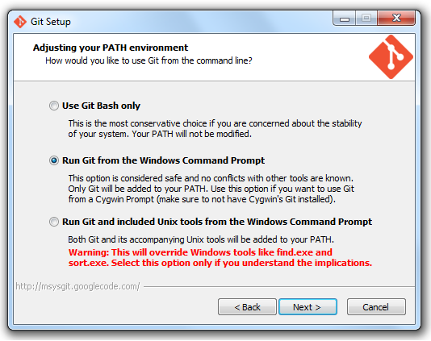

Development Environment 
=======

Tools, Scripts, WorkFlow

## Table of content

* [Setup git and hooks](#git-setup)
  * [For Windows Users (Trivial)](#git-win-trivial)
  * [For Power Windows Users (DIY)](#git-win-power)
  * [For OSX Users](#git-mac)
  * [For Ubuntu Users](#git-ubuntu)
* [Install newer nodejs on Ubuntu from repository](#node-ubuntu)
* [Setup Grunt task worker](#grunt)
* [How to contribute](#how-to-contribute)


<a name="git-setup"></a>
Setup git and hooks
=======
<a name="git-win-trivial"></a>
For Windows Users (Trivial)
-------
1. Download zip from [br-core-dev-env](https://github.com/br-core/dev-env/archive/master.zip)

2. Extract the zip file to your computer.
3. Click __/hooks/pre-install.bat__ then it will help you to download and install msysgit and nodejs for your OS (x86/x64).
3. Click __/hooks/update.bat__ then it will help you to placed LUA and pre-commit script under the correct path.
4. Click __/hooks/install_jshint.bat__ then it will help you to install jshint to check the syntax of javascripts.

After that, if the pre-commit script have been update, you just only need to do two steps as below:

1. Update pre-commit script(git pull) with any git client (sourcetree...etc).
2. Click update.bat.

<a name="git-win-power"></a>
For Power Windows Users (DIY)
-------
1. Download [Git](http://git-scm.com/download/win) Stand-alone for windows and install it

2. Download [Nodejs](http://nodejs.org/download/) for windows and install it
3. From Git Shell, install jshint (`npm install -g jshint`)
4. Download [SourceTree](http://www.sourcetreeapp.com/download/) for windows and install it (without portable Git)
5. Click update.bat then it will help you to placed LUA and pre-commit script under the correct path.
6. Click install_jshint.bat then it will help you to install jshint to check the syntax of javascripts.

<a name="git-mac"></a>
For OSX Users
-------
1. Download [git](http://git-scm.com/) for mac and install it. (You should already had git installed by default, check with (`which git`))
2. Download [Nodejs](http://nodejs.org/download/) for osx and install it
3. Install jshint (`npm install -g jshint`)
4. Find your lua path and change shebang of downloaded *pre-commit*, ex.(`#!/usr/local/bin/lua`)
5. Let *pre-commit* runnable (`sudo chmod +x pre-commit`)
6. Copy pre-commit to your shared folder of git, ex.(`/usr/share/git-core/templates/hooks/pre-commit`)
7. For sourcetree users, please also copy *pre-commit* to (`/Applications/SourceTree.app/Contents/Resources/git_local/share/git-core/templates/hooks/`)

<a name="git-ubuntu"></a>
For Ubuntu Users
-------
1. Install git(`sudo apt-get install git`)
2. Download [Nodejs](http://nodejs.org/download/) for linux and install it
3. Install jshint (`npm install -g jshint`)

<a name="node-ubuntu"></a>
Install newer nodejs on Ubuntu from repository
=======
1. Edit source list(`sudo nano /ect/apt/sources.list`)
2. Add (`http://archive.ubuntu.com/ubuntu/ quantal main restricted universe multiversedeb`) and (`http://security.ubuntu.com/ubuntu/ quantal-security main restricted universe multiverse`)
3. Update Package list(`sudo apt-get update`)
4. Install nodejs
```
  $sudo apt-get install python-software-properties

  $sudo add-apt-repository ppa:richarvey/nodejs

  $sudo apt-get update
  
  $sudo apt-get install nodejs
```
5. Check version(`node -v`)

<a name="grunt"></a>
Setup Grunt task worker
=======
1. Grunt template [Link](https://github.com/br-core/dev-env/tree/master/grunt/template)

<a name="how-to-contribute"></a>
How to contribute?
=======
1. Create a branch (`git checkout -b new_feature`)
2. Commit your changes (`git commit -am "Added awesome feature"`)
3. Push to the branch (`git push origin new_feature`)
4. Open a **[Pull Request]** for review and merge
